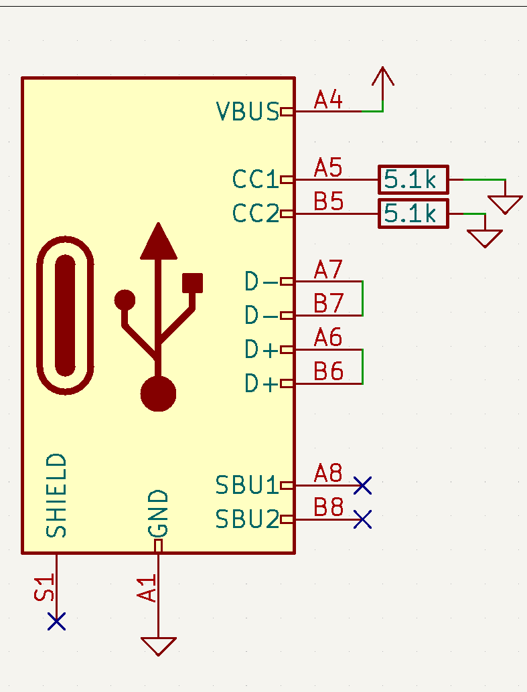

Have you ever had a device that has a USB Type C port on it, but it doesn't seem to charge using USB C to C cables? This seems to be a common problem to us. Just the other day, we were filming and attempting to recharge one of our microphones, and we were unable to use the USB type C Power Delivery brick that was sitting right in front of us. This is truly infuriating, especially once you know the answer. Today, we're going to dive into the USB Type C Legacy Device specification.

## The Physical Connectors

The most barebones physical USB C connection, USB 2.0, has twelve pins. MicroUSB has five. 
This could be a point of confusion for new or inexperienced designers using USB Type C for the first time. One may simply assume that you can connect the pins straight through, as you would for MicroUSB, and that it will work just fine. And, if they haven't tested thoroughly, they may find this to be the case. To support USB A to C, you need only connect Voltage, Ground, and USB Data. However, upon connecting a USB C to C cable, you'll find exactly zero volts at the output. This is because the USB C controller has no idea that anything was just plugged in at all, so it won't provide power, even if the device has it's USB Data lines connected.

## The CC Lines

This is where the CC lines come in. The UCB C controller uses the CC lines to establish the protocol with which to communicate with the connected device. For our purposes, this will be a power delivery request for 5v, 9v, 12v, or 20v [with 48v soon to come]. This requires an extra integrated circuit, or microcontroller to establish this communication though. For legacy devices where a simple 5v is needed however, you can simply stick two 5.1k Ohm pull-down resistors on the CC lines. Each line needs it's own resistor, as the specification uses these lines to determine the 'direction' the plug was inserted. This tells the controller that it's communicating to a legacy device and that it needs to provide 5v up to 1.5A or 3A depending on the source's capabilities.  
  

## The Bottom Line

And of course, what does this cost? Literally nothing. For a mere 100 5.1k Ohm resistors, we pay the unit price of **$0.0004**. That's $0.04 for the entire order. Each device needs two of these resistors, so we've spent less than a ***single cent*** to support the proper USB C legacy specification. This allows both USB A to C cables, and USB C to C cables to charge our connected device. If there's one thing you take away from this, PLEASE include those two tiny resistors in any of your designs that use USB C for charging. And Please, Let's get rid of MicroUSB entirely. We want one cable to rule them all.